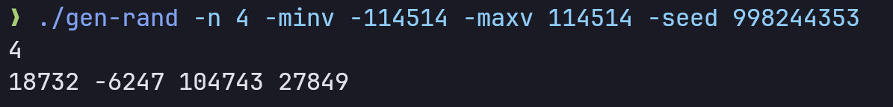
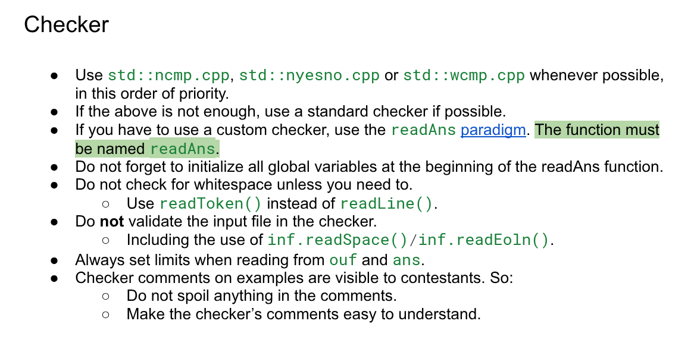
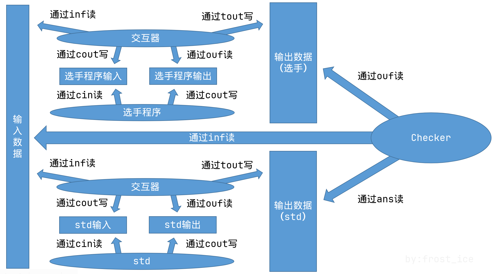

# Polygon：从入门到入门

大概是一份面向新手的 Polygon 算法竞赛出题平台教程。

## 可能有用的链接

Polygon 平台：[https://polygon.codeforces.com/](https://polygon.codeforces.com/)

一份相当全面的 LaTeX 公式手册：[https://www.cnblogs.com/1024th/p/11623258.html](https://www.cnblogs.com/1024th/p/11623258.html)

testlib 官方仓库：[https://github.com/MikeMirzayanov/testlib](https://github.com/MikeMirzayanov/testlib)

testlib Validator 使用教程：[https://codeforces.com/blog/entry/18426](https://codeforces.com/blog/entry/18426)

olymp.sty 官方仓库：[https://github.com/GassaFM/olymp.sty](https://github.com/GassaFM/olymp.sty)

OI-Wiki 的 testlib 教程：[https://oi-wiki.org/tools/testlib/](https://oi-wiki.org/tools/testlib/)

Codeforces 官方 Polygon 教程：[https://codeforces.com/testlib](https://codeforces.com/testlib)

Codeforces authors guide：[https://codeforces.com/r/authors-guide](https://codeforces.com/r/authors-guide)

Codeforces Authors' Polygon Rules：[https://codeforces.com/r/authors-polygon-rules](https://codeforces.com/r/authors-polygon-rules)

洛谷题面规范：[https://help.luogu.com.cn/rules/academic/problem-standard](https://help.luogu.com.cn/rules/academic/problem-standard)

# 写在前面

Polygon 是一个自动化程度相当高的算法竞赛出题平台。在开始之前，先简单聊一聊 Polygon 能帮我们干一些什么事情。

- 在 Polygon 上，你可以很方便的进行多人协作。你可以创建 Contest Groups，将题目的权限共享给出题组的其他人，互相之间帮对方修改题面、加数据、加 Solution。
- 在 Polygon 上，你只需要负责输入数据。Polygon 会自动帮你用 std 产生对应的输出数据。
- 在 Polygon 上，你可以编写 Validator，用于进行输入数据合法性的检验。编写正确的 Validator 可以有效防止错误数据的出现：比如一行输入 $$n$$ 个数，但是实际只有 $$n-1$$ 个；输入保证是凸包，但是数据中出现了凹包；输入格式要求 $$a_i \geq 1$$，但是数据中出现了 $$0$$。
- 你可以将单个题目（亦或是整场比赛的题目）导出为一个 Package，随后导入其他评测系统。CCPCOJ 目前已经支持导入 Polygon Package，对于 DOMJudge，你可以使用 [Polygon2DOMjudge](https://github.com/cn-xcpc-tools/Polygon2DOMjudge) 转换为 DOMJudge 支持的 Package 格式。

以下内容摘自 OI-WIKI：

- 有版本管理系统，多人合作时不会乱成一团，也不需要互相传文件。
- 出题系统完善，Validator、Generator、Checker、Solutions 环环相扣，输出自动生成。
- 可以为 Solutions 设置标签，错解 AC、正解未 AC 都会警告，方便地逐一卡掉错解。
- 可以方便地对拍，拍出来的数据可以直接添加到题目数据中。
- 发现问题可以提 issue，而不会被消息刷屏却一直没有 fix。
- 为日后出 CF 做准备。
- $$\ldots$$

# 基本使用

## 账号

Polygon 平台与 Codeforces 本站不共用账号。初次使用你需要注册一下 Polygon 平台的账号。


- `First Name` 与 `Last Name` 可以随便填。这两项是其他人也能够看到的。

- `Email` 这里建议填一个你的常用邮箱。与 Codeforces 本站不同，Polygon 是有 2FA 的。当你太久没登录，亦或是在其他设备上登录，Polygon 都会给你的邮箱发一个验证链接，要求你通过验证链接完成登录。

- `Login` 这一栏填的是你的**用户名**（而不是密码）。用户名是注册后就无法更改的。这与 Codeforces 本站不同。

## 题目列表

点击 `View Problems` 选项，即可进入题目列表界面。这里会列出所有你有权查看/有权编辑的题目。

Polygon 允许多个用户之间进行协作。你可以把题目的权限分享给其他人。

题目的权限分为两个等级，分别是 Read 和 Write。Read 表示可以看到题目的所有内容，但是无法进行修改。Write 表示在此基础上，你可以参与修改题目的内容。

列表里初始有 $$4$$ 个样例题目。


- `example-a-plus-b`：基础输入输出题。输入 $$a$$ 和 $$b$$，输出 $$a + b$$。
- `example-interactive-binary-search`：交互题。有一个介于 $$1$$ 到 $$10^6$$ 之间的数字 $$x$$。程序每次猜测一个数 $$y$$，交互器返回 $$x$$ 是否小于 $$y$$。需要在 $$25$$ 次交互内找到 $$x$$。
- `a-plus-b-graders`：你需要实现一个用于计算 $$a+b$$ 的函数。具体的，对于 C++，你需要实现一个 `int sum_ab(int a, int b);` 函数，对于 Python，你需要实现一个 `sum_ab(a: int, b: int) -> int` 函数。
- `example-almost-upper-bound`：Special Judge 题。给定 $$[a_1, a_2, \ldots, a_n]$$ 和一个非负整数 $$k$$，你需要找到一个整数 $$x$$，满足序列 $$a$$ 中恰好有 $$k$$ 个数 $$\leq x$$。有多个可行答案可以输出其中任意一种。

这 $$4$$ 个样例题目，你只有 `Read` 权限。但你可以将其克隆到你自己的题库里。具体方式下文会讲。

## 创建题目

点击上方的 `New Problem` 即可创建新的题目。


创建新的题目时，我们需要为题目确定一个标识性的题目 id。需要注意，这个不是题目的标题。题目 id 可以包含小写英文字母，以及中划线（`-`）。

具体取什么取决于你。但最好做到，出题组的所有人，都能较容易的将题目具体的内容和题目 id 联系起来。否则取个很怪的名字何尝不是一种折磨自己。

比如要出一个简单的排序题的话，我们可以叫它 `simple-sorting-problem`。

## 基本信息

点击 `Start` 进入编辑后，默认会进入 General info 页面。


这里你可以编辑题目的输入/输出文件、时间/空间限制、是否是交互题，等信息。

Tags 一栏，你可以为题目添加 Tag，用于说明这个题目用在了哪场比赛、考察了什么算法，便于需要的时候进行筛选。

点击 `Advanced`，可以进入高级信息编辑。


这里你可以重命名题目的 id；将其克隆为一个新的题目；或者是删除题目。

`Run solutions twice` 的意思是将题目设置为通信题。具体请参照 [OI-Wiki 上的相关介绍](https://oi-wiki.org/contest/problems/#%E9%80%9A%E4%BF%A1%E9%A2%98)。

## 题面

点击上方的 `Statement`，即可跳转到编辑题面的页面。此时你需要选择一种语言，并创建题面。


{: .note }
> 如果你需要去 Codeforces 上拉 mashup 来验题（或者是赛后要上 gym）的话，不管实际语言是什么，此处都建议选择 `English`。

Codeforces 的题目渲染存在一个奇怪特性。只要你选择的不是英文或是俄文，将题目导入 Codeforces 之后，题面数学公式将无法正常渲染。具体情况可能如图。


作为对比，以下是正常渲染的结果。


当然，如果你不需要把题面导入 Codeforces，那么以上注意事项可以无视。

点击 `Create` 完成题面的创建。


Polygon 的题面编写使用的是 LaTeX 语法。常用语法可以点击旁边的 `brief manual` 进行查看。

点击 `Edit with Preview` 可以进入可视化编辑。

- `Name`：题目标题
- `Legend`：题目内容
- `Input`：输入格式
- `Output`：输出格式
- `Notes`：样例说明等其他补充说明

对于中文题面，可以参考洛谷题面规范，以及牛客/洛谷的近期比赛题目进行编写（不建议参考洛谷早期题库题目，也不建议参考牛客主题库的题目，其中题面乱写或是不规范的太多了）。

编辑完成后，点击下方 `Save` 保存即可。


## 版本管理

Polygon 也具有类似 git 的版本管理机制。虽然细节上不一定足够智能，但是也足够团队出题用了。

你对题目进行编辑之前，Polygon 会先创建一个工作副本（working copy）。你所有的修改都将基于该工作副本进行。页面右下角，我们可以看到目前有哪些文件是我们修改过的。


{: .note }
> 建议每做完一个阶段的修改，都进行一次 commit。

点击右下角的 `Commit Changes`，即可编辑 Commit Message 并**正式提交**所有的修改。


默认情况下，每次进行提交，系统都会给**所有有该题目权限的人**发邮件，告诉他们你进行了这些修改（你自己也会收到邮件）。

如果你不希望系统去发邮件，请将下方的 `Don't send email notification` 勾选上。

除此之外，同样是页面右下角，有一个 `View Chagnes` 的选项。


其中你可以看到该题目过去的每个版本都修改了哪些内容。


点击 `switch` 可以**暂时**切换到某个过去的版本（回到 View Problems 页面再重新进入题目，将会重新回到最新版本）

假设当前已有 $$N$$ 个版本。当你点击 `revert` 时，可将当前工作副本回退到某个历史版本 $$K$$。你可以在该版本基础上进行修改，commit 后会产生新版本 $$N + 1$$。版本 $$K + 1$$ 到 $$N$$ 之间的所有历史记录均会保留，不会被覆盖掉。

如果你希望舍弃掉所有没有 commit 的修改，回到 View Problems 页面，并对该题目的 `Working Copy` 一栏点击 `Discard` 即可


## Solution files

在 Solution files 页面，你可以上传题目代码。

第一个上传的代码会被标记为 Main correct solution，即最核心的 std 代码。


除此之外，你还可以将其他类型的代码（比如会 WA/TLE/MLE 的错解）也一起加进来，并给他们标注上对应的类型。在 Verification 环节（后面会讲到），Polygon 会帮你检查这些代码的行为是否符合对应的标签。具体如下：

| 类型                                         | 要求                                                         |      |
| -------------------------------------------- | ------------------------------------------------------------ | ---- |
| Correct solution                             | **所有数据的运行结果只能是 AC**。std 以外的能够 AC 的代码可以标记成此类。 |      |
| Time limit exceeded                          | **所有数据的运行结果只能是 AC 或者 TLE，且必须在部分数据上 TLE**。你可以把复杂度不对的解都标记为这一类。如果它在一倍时限的情况下超时，二倍时限的情况下通过，Polygon 也会给你相应警告，但是能够通过 Verification。 |      |
| Time limit exceeded or correct               | **所有数据的运行结果只能是 AC 或者 TLE**。与上一类相比，**如果它实际没有 TLE，那么你的题目依旧可以通过 Verification**。可能会超时的大常数写法可以被标记成这一类。 |      |
| Memory limit exceeded                        | **所有数据的运行结果只能是 AC 或者 MLE，且必须在部分数据上 MLE**。 |      |
| Time limit exceeded or memory limit exceeded | **所有数据的运行结果只能是 AC、TLE 或者 MLE，且必须在部分数据上 TLE 或 MLE**。 |      |
| Failed                                       | **所有数据的运行结果只能是 AC 或者 RE，且必须在部分数据上 RE**。 |      |
| Incorrect                                    | 所有 AC 不了的代码都可以标记成这一类。只要上述标签有可以使用的，那么请使用上述的更加具体的标签，而不是这个。除非这个代码真的无法归类。 |      |

## 测试数据

接下来，在 Tests 页面，我们可以添加测试数据。我们可以先手造一些小数据，点击 `Add Test` 进行添加。


我们只需要添加输入即可。开头提到过，Polygon 会自动拿我们的 std 去产生对应的输出数据。

勾选上下方的 `Use in statements` 即可将其设为样例。


我们添加的数据，Polygon 会自动去掉行末空格，并保证数据的最后有一个 ```\n```。

此处特别说明一下，虽然大家平时都叫它“换行符”，但根据 POSIX 规范，其实它应该是“行尾标识符”，需要出现在每一行的末尾，用于表示一行的结束。

### Generator

数据生成器（Generator）是一类特殊的程序，作用是输出一组测试数据。

小数据可以手造，而大数据我们就需要借助 Generator 来生成。

在开始之前，我们先讲一讲 Generator 应当遵守的范式。

{: .highlight }
> Generator 可以追求一定的复用性。我们可以通过传递不同的参数，来让一个 Generator 生成多组不同的数据。

比如可以让我们的 Generator 具有如下行为：我们用 `./gen-rand -n 10` 可以生成一组 $$n = 10$$ 的数据，改成 `./gen-rand -n 99` 从而生成一组 $$n = 99$$ 的数据。

{: .highlight }
> Generator 的行为应当是可复现的。你在任何时间、任何处理器架构、任何操作系统上，只要是同一个 Generator 和相同的参数，都应当得到相同的一组数据。

有些输入量极大的题，单组输入数据可能动辄十几 MB，总共加起来可能要突破若干 GB。只要 Generator 的行为是可复现的，我们记下 Generator 的代码以及我们用到的参数，就相当于存下了这组数据。因为我们可以在任何时候由此将数据造出来。而造出来的数据，就属于用完就可以删的东西了。

回到正题。建议使用 testlib 库进行 Generator 的编写。

以下是一个示例，其作用是输出一组满足「第一行一个整数 $$n$$，第二行 $$n$$ 个用空格分隔的整数」的数据：

```cpp
// code by: frost_ice
#include <bits/stdc++.h>
#include "testlib.h"

using namespace std;
using i64 = long long;
using u32 = unsigned int;
using u64 = unsigned long long;
using db = long double;

int main(int argc, char *argv[]) {
	registerGen(argc, argv, 1);

	int n = opt<int> ("n");
	int minv = opt<int> ("minv", -1'000'000'000);
	int maxv = opt<int> ("maxv",  1'000'000'000);

	i64 seed = opt<i64> ("seed", -1);

	if (seed != -1) rnd.setSeed(seed);

	vector<int> a(n);
	for (auto &i : a) {
		i = rnd.next(minv, maxv);
	}

	println(n);
	println(a);
}
```

这里的 ```opt<XXX>``` 是 testlib 提供的用于获取参数的接口。

假设我们用编译好的可执行文件叫做 `gen-rand`，我们执行 `./gen-rand -n 10 -minv -100 -maxv 100` 这一命令，这样一来，在程序内部，$$n$$ 将被赋值为 $10$，$minv$ 将被赋值为 $-100$，以此类推。

```opt<XXX>``` 的第二个输入参数是该变量的默认取值。比如代码中的 ```int minv = opt<int> ("minv", -1'000'000'000);```，如果你没有提供命令参数 ```minv```，那么 $$minv$$ 的默认取值就是 $$-10^9$$。

如果你想在命令参数中，指定 `string`、`double` 等其他类型的变量，相应的把模板参数替换掉，使用 `opt<string>`、`opt<double>` 等即可。

`rnd` 是一个 testlib 提供的随机数生成器。它默认的种子是取所有命令参数的哈希。你也可以用 `rnd.setSeed` 的方式，为其手动设置种子。并且，`rnd` 的随机数生成，是具有上文所说的可复现性的。

这样写完 Generator 后，我们用 `./gen-ran -n 10 -minv -100 -maxv 100` 即可生成一组，$$n = 10$$，所有数字介于 $$-100$$ 到 $$100$$ 之间的随机数据。


我们改一下参数，用 `./gen-ran -n 4 -minv -114514 -maxv 114514` 即可生成一组，$$n = 4$$，所有数字介于 $$-114514$$ 到 $$114514$$ 之间的随机数据。


在上述代码中，还预留有一个叫做 `seed` 的参数，我们可以利用其手动设置随机种子。

`./gen-ran -n 4 -minv -114514 -maxv 114514 -seed 998244353`



之后我们讲一下 Generator 可能会经常用到的一些语句。

- `rnd.next(L, R)`：返回一个 $$L$$ 到 $$R$$（需要同为 `int`、`long long` 或 `double`）之间的随机数。
- `rnd.wnext(L, R, type)`：
  - $$type$$ 为 $$0$$ 时等同于 `rnd.next(L, R)`；
  - $$type > 0$$ 时等同于生成 $$type+1$$ 个介于 L 到 R 之间的随机数并取 **max**；
  - $$type < 0$$ 时等同于生成 $$-type+1$$ 个介于 L 到 R 之间的随机数并取 **min**。
  （事实上，testlib 只会在 $$type$$ 绝对值很小的时候暴力做 $$|type|+1$$ 次随机，当 $$type$$ 绝对值较大的时候，其实是通过 `pow` 函数去拟合该分布，从而确保效率）
- `rnd.any(vector<T> vec)`：返回 `vector`（或 `string`）中的随机一个元素（是拷贝而非引用）。
- `rnd.next(string regex)`：返回一个符合指定**极简正则表达式**（具体参照 [OI-Wiki 上的相关介绍](https://oi-wiki.org/tools/testlib/general/#%E6%9E%81%E7%AE%80%E6%AD%A3%E5%88%99%E8%A1%A8%E8%BE%BE%E5%BC%8F)）的字符串。
- `rnd.perm(int n, int l)` 返回一个 $$l$$ 到 $$l+n-1$$ 之间所有整数的排列。
- `rnd.distinct(int n, int l, int r)`：返回 $$n$$ 个介于 $$l$$ 到 $$r$$ 之间的两两不同的整数。
- `rnd.partition(int n, int sum, int l)`：返回 $$n$$ 个 $$\geq l$$ 的整数，总和为 $$sum$$。
- `shuffle(iterator l, iterator r)`：效果等效于 `std::shuffle`，即打乱 $$[l, r)$$ 范围内的数。对于有需要的情况，请使用它而不是 `std::shuffle`。更不要使用 `random_shuffle`，因为不同的编译器产生的结果可能是完全不同的，这会让可复现性完全丧失。

接下来再举一个例子，$$T$$ 组测试用例，每组一个 $$n$$ 个点的无根树，节点编号 $$1$$ 到 $$n$$，$$n$$ 总和不超过 $$2 \times 10^5$$。

```cpp
// code by: frost_ice
#include <bits/stdc++.h>
#include "testlib.h"

#define REP(i,l,r) for (auto i=l; i<=r; i++)
#define REV(i,l,r) for (auto i=l; i>=r; i--)

using namespace std;
using i64 = long long;
using u32 = unsigned int;
using u64 = unsigned long long;
using db = long double;

int main(int argc, char *argv[]) {
	registerGen(argc, argv, 1);

	int T = opt<int> ("T", 1);
	int sum = opt<int> ("sum", 200'000);
	int min_n = opt<int> ("min_n", 2);
	int min_w = opt<int> ("min_w", -50);
	int max_w = opt<int> ("max_w",  50);

	i64 seed = opt<i64> ("seed", -1);
	if (seed != -1) rnd.setSeed(seed);

	vector<int> n_val = rnd.partition(T, sum, min_n);

	println(T);

	REP(tt, 0, T-1) {
		int n = n_val[tt];
		vector<array<int, 2>> e;

		int w = rnd.next(min_w, max_w);

		REP(i, 1, n-1) { // 从 [0, i-1) 中找一个点跟 i 连边
			e.push_back({rnd.wnext(0, i-1, w), i});
		}

		vector<int> perm = rnd.perm(n);
		for (auto &[u, v] : e) {
			u = perm[u], v = perm[v]; // 按照 perm 重映射编号
			if (rnd.next(0, 1)) swap(u, v);
		}

		shuffle(e.begin(), e.end());

		println(n);
		for (auto [u, v] : e) {
			println(u+1, v+1); // 转为 1-index
		}
	}
}
```

在一开始，我们先通过 `rnd.partition` 将 $$n$$ 的总和分配给每一组测试用例。接下来依次处理每个测试用例。为了方便起见，我们先使用 0-index。

这里造树的方法是，对于节点 $$1, 2, 3, \ldots, n-1$$，第 $$i$$ 个节点随机向 $$[0, i)$$ 中的点进行连边。

这里在连边的过程中，使用了 `rnd.wnext(0, i-1, w)` 来确定 $$i$$ 的父亲节点。$$w < 0$$ 的话，它会更靠近 $$0$$，最终的结果就会更接近一个菊花；而 $$w > 0$$ 的话，它会更靠近 $$i-1$$，最终的结果也会更加接近于一条链。

以下是 `-T 1 -sum 15 -min_w 5 -max_w 5` 的结果：


以下是 `-T 1 -sum 15 -min_w -10 -max_w -10` 的结果：


（图片使用 [Another Gragh Editor](https://anacc22.github.io/another_graph_editor/) 进行绘制）

由此可见，我们通过调节 $$w$$ 的范围，即可造出我们想要的形态的树。

[testlib 官方仓库](https://github.com/MikeMirzayanov/testlib) 也附带有不少示例。可供各位参考。

上传 Generator 的方式是，打开 Files 页面，Source Files 这一栏点击上传。


之后回到 Tests 页面，我们在 `Script` 文本框中加入用于生成数据的命令语句，并点击保存：


语句的格式是：

```
生成器 参数 > 数据编号
```

最后的“数据编号”指的是，该命令用于生成的是第几组数据。比如生成第 $$13$$ 组数据的话就是 ```> 13```。使用 ```> $``` 表示自动顺延编号。

之后打开 Preview Tests 页面，即可看到我们添加的数据。


对于需要用到不止一个 Generator 的情况，建议给每个 Generator 都设置一个合理的名字。

不建议叫做 `gen1`、`gen2`，否则过一段时间你就会忘了它是做什么的。

Codeforces Authors' Polygon Rules 推荐我们使用 `gen_path`、`gen_binary` 等意义明确的名称。


## Validator

Validator 也是一个相当重要的工具。它用于检验所有的输入数据是否符合要求。

比方说一行输入 $$n$$ 个整数，你需要确保这一行确实是 $$n$$ 个整数，不能是 $$n+1$$ 个，也不能是 $$n-1$$ 个。

比如输入的是 $$1$$ 到 $$10^9$$ 范围内的正整数，你就需要保证它确实是在这个范围里，不能出现超出范围的数字。

再比如输入是一个凸包，你需要在 Validator 中检测，它到底是不是凸包。如果你不小心造了个凹包，那它必须被 Validator 检测出来。

[Kattis problem package format](https://icpc.io/problem-package-format/spec/legacy-icpc.html)（也是目前 ICPC World Finals 以及不少地区的区域赛所采用的标准）更是明文规定，所有题目都需要有 Validator。


以下是一个 Validator 示例：作用是，先读入一个第一行的 $$n$$，需要保证 $$1 \leq n \leq 100$$，接下来再读入第二行的 $$n$$ 个整数 $$a_1, a_2, \ldots, a_i$$，需要保证 $$-10^9 \leq a_i \leq 10^9$$。


`int n = inf.readInt(1, 100, "n");` 表示，读一个介于 $$1$$ 到 $$100$$ 的整数，它的名字叫做 `n`。第三个参数的目的是，如果遇到不对的数据，你能够从错误信息中知道，是哪个数没读到，亦或是超出范围了。

`vector<int> a = inf.readInts(n, -1'000'000'000, 1'000'000'000, "a");` 是读取 $$n$$ 个用空格分隔的整数，所有数需要介于 $$-10^9$$ 到 $$10^9$$ 之间。

只要是一行 $$n$$ 个数的情形，最好都使用 ```inf.read*s()``` 去一次读完，而不是写一个 for 循环挨个读取。

并且 Codeforces Authors' Polygon Rules 也推荐你这么做：

{: .highlight }
> Use array-reading functions ```read*s(n,...)``` instead of loops whenever possible.

这样做除了方便还有一个好处：如果其中有数字超出了范围，testlib 会通过错误信息告诉你是第几个数超出了范围。例如如下错误信息：

```text
FAIL Integer element a[2] equals to 1000000001, violates the range [-10^9, 10^9] (stdin, line 2)
```

我们很容易知道，是序列 $$a$$ 的第 $$2$$ 个数超出了范围。

{: .note }
> 在 Validator 中，所有的不可见字符都需要显式的写上对应的读入语句，从而保证输入数据的格式是完全正确的。

具体的，你需要用 `inf.readEoln();` 语句去读换行符，用 `inf.readSpace();` 去读空格，用 `inf.readEof();` 去读文件结尾。

接下来的例子，作用是，读入一行两个用空格分隔的整数 $$x$$ 和 $$y$$，范围需要介于 $$1$$ 到 $$10^9$$ 之间，并且保证 $$x \neq y$$。


这里的 `ensuref` 函数可以进行一个类似 assert 的断言操作。

以上面为例，假设输入的两个数是 `123 123`，由于 $$x \neq y$$ 的断言失败，你能将会看到 `FAIL x should not equal to y, (x=123, y=123)` 的错误信息。

接下来的例子是，$$T$$ 组测试用例（$$1 \leq T \leq 10^5$$），每组一个森林，$$2 \leq n \leq 2 \times 10^5$$ 且 $$0 \leq m \leq 2 \times 10^5$$，多测的 $$n$$ 和 $$m$$ 总和不超过 $$2 \times 10^5$$。

```cpp
// code by: frost_ice
#include <bits/stdc++.h>
#include "testlib.h"
#define REP(i,l,r) for (auto i=l; i<=r; i++)
#define REV(i,l,r) for (auto i=l; i>=r; i--)

using namespace std;
using i64 = long long;
using u32 = unsigned int;
using u64 = unsigned long long;
using db = long double;

struct DSU {
	vector<int> fa;
	DSU(int siz) : fa(siz + 1) {
		iota(fa.begin(), fa.end(), 0);
	}
	int find(int x) {
		if (x == fa[x]) return x;
		return fa[x] = find(fa[x]);
	}
	void merge(int x, int y) {
		fa[find(x)] = find(y);
	}
	int check(int x, int y) {
		return find(x) == find(y);
	}
};

int main(int argc, char *argv[]) {
	registerValidation(argc, argv);

	int T = inf.readInt(1, 100'000, "T");
	inf.readEoln();

	i64 sum_n = 0;
	i64 sum_m = 0;

	REP(tt, 1, T) {
		setTestCase(tt);

		int n = inf.readInt(2, 200'000, "n");
		inf.readSpace();
		int m = inf.readInt(0, 200'000, "m");
		inf.readEoln();

		DSU f(n);

		REP(i, 1, m) {
			int u = inf.readInt(1, n, std::format("u_{}", i));
			inf.readSpace();
			int v = inf.readInt(1, n, std::format("v_{}", i));
			inf.readEoln();

			ensuref(!f.check(u, v), "Not a forest");
			f.merge(u, v);
		}

		sum_n += n, sum_m += m;

		ensuref(sum_n <= 200'000, "sum of n should <= 2E5");
		ensuref(sum_m <= 200'000, "sum of m should <= 2E5");
	}

	inf.readEof();
}
```

对于多组测试用例的情况，可以使用 `setTestCase(XXX);` 来告诉 testlib，我现在在检验第几组测试用例，方便 testlib 在错误信息中进行展示。

比如以下这组数据，你会发现第二个测试用例的 $$n$$ 显然不符合范围。

```text
2
5 2
1 2
3 4
998244353 2
114 514
1919 810
```

当我们对其进行检验的时候，我们就能看到如下错误信息：

```text
FAIL Integer parameter [name=n] equals to 998244353, violates the range [2, 200000] (test case 2, stdin, line 5)
```

除此之外，对于 `ensuref` 失败的情况，我们也能通过错误信息知道错误发生在第几个测试用例上。

比如以下数据，第三个测试用例中出现了环，所以它不是森林。

```text
3
3 1
1 2
3 2
1 2
2 3
5 4
1 2
1 3
2 3
3 4
```

我们看到的错误信息会是：

```text
FAIL Not a forest (test case 3)
```

对于没法使用 `inf.readXXXXs` 进行读入的数据（比方说这里的 $$m$$ 条边）可以使用类似 `std::format("v_{}", i)` 的语句，用于标识读入的是第几条边的 $$u$$（或者是 $$v$$）。

需要注意 testlib 本身也附带有一个 `format` 函数，它的格式化字符串与 C 的 `sprintf` 是等同的（也就是使用 `%d`、`%.2f` 等关键字）。记得把它和 `std::format` 区分开来。

之后介绍几个常用的函数/语句。

| 语句                                                         | 作用                                                         |
| ------------------------------------------------------------ | ------------------------------------------------------------ |
| `inf.readInt(L, R, name)`                                    | 读入一个介于 L 到 R 之间的 `int` 类型整数                    |
| `inf.readLong(L, R, name)`                                   | 读入一个介于 L 到 R 之间的 `long long` 类型整数              |
| `inf.readDouble(L, R, name)`                                 | 读入一个介于 L 到 R 之间的浮点数。比如对于 `inf.readDouble(0., 1., "x");`，以下输入都会被判成合法的：`0.1e-3`、`0.`、`0.12345` |
| `inf.readStrictDouble(L, R, minPrecision, maxPrecision, name)` | 读入一个介于 L 到 R 之间的浮点数，要求必须是 `XXX.xxx` 格式，并且小数点后位数介于 minPrecision 和 maxPrecision 之间。比如对于 `inf.readStrictDouble(0., 1., 0, 4, "x");`，以下输入都不合法：`0.1e-3`、`0.`、`00.0`。而以下是合法的：`0`、`0.00`、`0.123`。 |
| `inf.readToken(regex, name)`                                 | 读入一个**不包含**不可见字符（如空格、制表符等）的字符串，需要匹配给定的**极简正则表达式**（具体参照 [OI-Wiki 上的相关介绍](https://oi-wiki.org/tools/testlib/general/#%E6%9E%81%E7%AE%80%E6%AD%A3%E5%88%99%E8%A1%A8%E8%BE%BE%E5%BC%8F)）。 |

当然，大部分的 `readXXX`，都有后面加上 `s` 的一次读入多个的东西的版本。调用时所需参数的变化，都与 `readInts` 之于 `readInt` 相类似。

更多有关 Validator 的文档可以参照[这篇博客](https://codeforces.com/blog/entry/18426)。

[testlib 官方仓库](https://github.com/MikeMirzayanov/testlib) 也附带有不少示例。这里就不过多展开了。

### Validator Tests

此时在侧边栏，我们会注意到有个被标黄的地方。这是因为我们还没有设置 Validator Tests。


就好比一个题目的测试数据是用于检验选手代码有没有写对，Validator Tests 是用于检验你的 Validator 有没有写对。

这里我们手造几组，并确保，在我们能够想到的各种情况（或者是代码里每一个可能会报出问题的地方）对应的小数据上，Validator 的运行结果都能够符合我们的预期，即可。

点击 `Add test` 即可添加数据。你可以一次添加多个数据，用 `===` 分隔即可，具体方式如下：

```text
6
1 1 4 5 1 4
===
3
-1000000000 0 1000000000
===
1
1000000001
===
1
-1000000001

```

```text
1
1
0
0
```

输出这里，1 表示合法，0 表示不合法。


之后点击 `Run tests`，即可跑一遍我们的数据，并检查 Validator 在上面的表现是否符合我们的预期。


## Checker

在 Checker 页面，我们可以设置 Checker。

Checker 的作用是，根据**输入数据、std 输出，选手程序输出**这三项内容，判断选手程序是否输出正确。

### 默认 Checker

对于答案固定的题，直接比较选手程序的输出与 std 的输出是否完全相等，固然是最简单的一种方式。可是随之而来的也有很多问题，比方说选手程序多输出了个行末空格，或者是少输出了个 ```\n```，就会被判成 WA。这显然太丧心病狂了。

所以 Polygon 给我们提供了许多人性化的 Checker。


先介绍几个最常用的 Checker。

- `std::ncmp.cpp`：适用于输出是**多个 long long 范围内整数**（$$-2^{63} \sim 2^{63} - 1$$）的情况，忽略所有不可见字符的情况下，判断选手程序输出的各个整数是否和 std 相等。
- `std::nyesno.cpp`：适用于输出是**多个 `YES` / `NO`** 的情况，在忽略大小写的情况下，判断选手程序输出的各个 `YES` / `NO` 是否和 std 相等。例如 `yeS` 会被认为和 `YES` 相等。
- `std::rcmp4.cpp` / `std::rcmp6.cpp` / `std::rcmp9.cpp`：适用于输出是**多个浮点数**的情况，在相对误差 $$10^{-4}$$ / $$10^{-6}$$ / $$10^{-9}$$ 的情况下判断选手程序输出是否和 std 相等。
- `std::wcmp.cpp` 在忽略所有不可见字符，把输出当成「用不可见字符分隔的若干个字符串」的情况下，判断选手输出与 std 是否相等。

以及不一定常用的：

- `std::fcmp.cpp`：需要选手输出与 std 输出完全相等，包括所有的不可见字符。这很丧心病狂。
- `std::hcmp.cpp`：适用于输出是**单个高精度整数**的情况，可以检测出前导 0 等格式问题。
- `std::lcmp.cpp`：在忽略多余空格与文件末尾的多余 ```\n``` 的情况下，判断选手程序输出的每一行是否和 std 输出相等。
- `std::yesno.cpp`：判断**单个 `YES` / `NO`**，忽略大小写。个人认为意义不明。

对于输出是一堆 long long 范围内整数的情况，我们直接选择 `std::ncmp.cpp` 即可。

顺带一题，Codeforces Authors' Polygon Rules 推荐在可能的情况下，优先选择 `std::ncmp.cpp`、`std::nyesno.cpp` 以及 `std::wcmp.cpp`。



然后补充说明一下 `std::wcmp.cpp` 以及 `std::lcmp.cpp` 的一些异同点（以下使用 `␣` 符号表示空格，`↵` 符号表示 ```\n```）：

以下两种输出，`std::wcmp.cpp` 会认为它们**相等**，`std::lcmp.cpp` 也会认为它们**相等**。

```text
abc␣def␣ghi↵
hahaha↵
```

```text
abc␣␣␣def␣␣␣␣␣ghi↵
␣␣␣␣␣␣␣␣␣␣hahaha↵
↵
↵
```

以下两种输出，`std::wcmp.cpp` 会认为它们**相等**，`std::lcmp.cpp` 会认为它们**不相等**。

```text
abc␣def␣ghi↵
hahaha↵
```

```text
abc␣␣␣␣␣␣␣␣␣␣↵
↵
↵
↵
↵
␣␣␣␣␣␣def␣ghi↵
↵
hahaha↵
```

以下两种输出，`std::wcmp.cpp` 会认为它们**相等**，`std::lcmp.cpp` 会认为它们**不相等**。

```text
abc␣def␣ghi↵
hahaha↵
```

```text
abc␣def↵
ghi↵
hahaha↵
```

以下两种输出，`std::wcmp.cpp` 会认为它们**相等**，`std::lcmp.cpp` 会认为它们**不相等**。

```text
abc␣def␣ghi↵
hahaha↵
```

```text
abc␣def␣ghi↵
↵
hahaha↵
```

以下两种输出，`std::wcmp.cpp` 会认为它们**不相等**，`std::lcmp.cpp` 也会认为它们**不相等**。

```
abc def ghi
```

```
abc def hahaha
```

### 关于自定义 Checker

在需要 Special Judge（也就是一个题可能有多种满足要求的输出）的题目中，我们可能需要手写自定义的 Checker 来验证选手输出的正确性。

{: .warning }
> 永远不要信任选手程序的输出；同时，也要在编写 Checker 的时候预防好 std 可能出错的情况。

我们依旧是使用 testlib 库进行 Checker 的编写。

我们先看一个例子，题目大意是：

- 给定一个正整数 $$n$$。你需要将其分解为尽可能少的若干个质数之和。
- 不存在方案则输出 $$-1$$；否则输出两行，第一行是 $$k$$，第二行是 $$k$$ 个质数。
- $$1 \leq n \leq 10^6$$，多测，$$1 \leq T \leq 10$$。

以下是对应的 Checker 代码：

```cpp
// code by: frost_ice
#include <bits/stdc++.h>
#include "testlib.h"

using namespace std;
using i64 = long long;
using u32 = unsigned int;
using u64 = unsigned long long;
using db = long double;

template <typename T> void chmax(T &a, T b) { if (a < b) a = b; }
template <typename T> void chmin(T &a, T b) { if (b < a) a = b; }

int isPrime(int n) {
	if (n % 2 == 0) return n == 2;
	for (int i = 3; i <= n / i; i ++) {
		if (n % i == 0) return 0;
	}
	return n != 1;
}

int n;

int readAns(InStream &in) {
	int k = in.readInt(-1, 10, "k");

	if (k == -1) return -1;

	vector<int> p = in.readInts(k, 2, n, "p");

	i64 sum = accumulate(p.begin(), p.end(), 0LL);

	if (sum != n) {
		in.quitf(_wa, "Sum of primes (%lld) does not equal n (%d).", sum, n);
	}

	for (int i = 1; i <= k; i ++) {
		if (!isPrime(p[i-1])) {
			in.quitf(_wa, "Number p[%d]=%d is not prime.", i, p[i-1]);
		}
	}

	return k;
}

int main(int argc, char *argv[]) {
	registerTestlibCmd(argc, argv);

	int T = inf.readInt(1, 10, "T");

	for (int tt = 1; tt <= T; tt ++) {
		setTestCase(tt);

		n = inf.readInt(1, 1'000'000, "n");

		int ansv = readAns(ans);
		int resv = readAns(ouf);

		if (ansv == -1) {
			if (resv == -1) {
				// AC
			} else {
				quitf(_fail, "Jury found no solution but participant did.");
			}
		} else {
			if (resv == -1) {
				quitf(_wa, "Participant found no solution but jury did.");
			} else {
				if (resv == ansv) {
					// AC
				} else if (ansv < resv) {
					quitf(_wa, "Jury had a better solution.");
				} else {
					quitf(_fail, "Participant solution is better than jury's.");
				}
			}
		}
	}

	quitf(_ok, "All %d test cases passed.", T);
}
```

与之前介绍过的 Validator 类似。在 Checker 中，我们使用三个流对象：
- `inf`：读取输入数据
- `ouf`：读取选手输出
- `ans`：读取 std 输出

{: .note }
> 在 Checker 运行之前，Validator 是已经运行过的。请不要在 Checker 中对输入数据进行额外合法性检查。
> 
> 同时请不要用 `inf.readSpace` 等函数去读输入或是输出数据中的空白字符。

比如输入数据保证 $$x \neq y$$ 的话，你正常把 x 和 y 读入进来即可，额外写 `ensuref` 判断 x 是否等于 y 是没有意义的。

Codeforces Authors' Polygon Rules 要求，自定义 Checker 必须遵循 [readAns 范式](https://codeforces.com/blog/entry/18431)。具体的：

- 你需要实现一个叫做 `readAns(XXX)` 的函数，传入参数包括 `InStream&`（`ouf` 以及 `ans` 都是 `InStream` 类的实例），负责读取输出并检验输出本身的合法性。
- 在 main 函数内，你需要依次进行（如果是多测的话，对于每组测试用例依次进行）：通过 `inf.readXXX` 读取输入数据，之后分别调用 `readAns(ans)` 与 `readAns(ouf)`，读取 std 输出与选手程序输出。
- 如果该题属于「输出在满足给定要求的情况下，还要最优化某个值」、或者是「可能无解，也可能有解」的话，你需要将 `readAns(XXX)` 设置一个返回值，用于传递「需要最优化的那个值」、「是否找到了答案」等信息。在 main 函数内，调用完 `readAns(ans)` 与 `readAns(ouf)` 后，通过相应的返回值，进行「选手输出和 std 输出谁优谁劣」、「是否出现 std 找到答案但是选手程序没有」等判断，并返回相应结果。
- 如果是「输出满足给定要求即可，且必定有解」的话，`readAns(XXX)` 的返回值可以为 `void`，也就是读入之后就没有后续步骤了。

在 Checker 中，有一个特殊的函数叫 `quitf`，其作用是，使 Checker 程序终止并返回最终的评测结果。

常见的评测结果有如下三类：

- ```_ok```（OK）：表示输出被判定为正确。
- ```_wa```（WRONG_ANSWER）：表示输出被判定为错误。
- ```_fail```（CRASHED）：表示评测出错，也即 Judgement Failed。

{: .warning }
> 对于多测的情况，务必记得不要提前返回 ```_ok```。

在编写 Checker 的时候，如果出现「std 输出不合法」、「选手程序输出优于 std 输出」或者是「std 没有找到解但是选手程序找到了」等 std 出现错误的情况，请务必保证结果是 CRASHED。在大部分平台上（包括但不限于 Codeforces、DOMJudge 等），这一评测结果都会以**相当醒目**的方式通知到出题组，告诉出题组这道题出锅了。

在 main 函数中，请直接调用 `quitf`。而在 `readAns` 函数内部，请使用 `in.quitf` 作为替代。

当此处的 `in` 是 `ans` 的时候，`in.quitf(_wa, XXXXX)` 对应的实际结果是 CRASHED。而 `in` 是 `ouf` 的时候，`in.quitf(_wa, XXXXX)` 对应的实际结果会是 WRONG_ANSWER。

这样一来，在 `readAns` 函数内部，我们无需判断我们当前处理的 `in` 到底是 `ans` 还是 `ouf`，只需要在不合法的时候调用 `in.quitf(_wa, XXX)` 即可。

前面提到，永远不要信任选手程序的输出。如果可能遇到超出 `int` 范围的，请一定要用 `long long`。其他各种刁钻输出也请一定要考虑到。

### Checker Tests

与 Validator Tests 类似，你可以在 Checker 页面下方，添加一些 Checker Tests，用于检验你的 Checker 有没有写出问题。


每组 Checker Test 都需要提供：输入数据、选手程序输出、std 输出，以及预期的结果（OK/WRONG_ANSWER/CRASHED）。std 输出可以点击 Generate Answer 直接生成。

在运行 Checker 之前，Validator 会先检验输入数据的合法性。


- 多测的话，不要总让 $$T = 1$$，并且记得添加「错误出现在中间的测试用例」的数据。
- 对于答案不合法（readAns 过程中发生错误）的情况，可以考虑给每个 if 语句都增加一个 Checker Test。
- 可以考虑给每个 quitf 语句都增加一个 Checker Test。
- 可以视情况添加以下几种数据：「有解但 std 没找到答案」、「std 答案不合法」、「有解但选手程序没找到答案」、「选手程序答案不合法」、「无解且双方均未找到答案」、「有解且双方答案正确」、「std 答案更优」、「选手程序答案更优」。

### 没卵用样例

如果你不希望选手通过样例猜到 std 的构造，你可能需要更改一下样例的输出。

具体的，我们有两种可行的方式。

第一种方式是，增加一份 std，并将其设为 Main Correct Solution。在代码中，特判一下样例：当遇到样例的时候，输出你准备好的没卵用构造。

第二种方式是，编辑样例，点击 `If you want to specify custom content of input or output data for statements` 旁边的 `click here`，随后在 `Input in statements` 与 `Output in statements` 中加入我们想让选手看到的输入/输出内容，覆盖掉原有的输入/输出。**留空表示不进行更改**。如果你希望选手看到的东西是空的，只填写一个行尾标识符（```\n```）即可。

下方 `Verify output for statements` 选项表示，是否要把自定义的输入/输出内容交给 Validator 与 Checker 去进行检验。尽量勾选上。


## 交互题

接下来简单讲一下另一类重要的题型，交互题。

交互题需要引入另一个相当重要的程序，交互器（Interactor）。

在传统的输入输出题中，选手程序直接从输入文件读数据，然后将结果写入输出文件。而在交互题中，交互器相当于一个中间层的作用：

- **输入数据**（并非std/选手程序的输入）只会被交互器读取；
- **输出数据**（并非std/选手程序的输出）只能由交互器来写；
- 在程序运行时，交互器负责提供选手程序的输入，接收选手程序的输出，在收到选手程序的输出后，反馈新的信息给选手程序，从而达到交互的效果。

这样一来，选手程序和交互器之间就像在对话：选手程序不断询问，交互器不断回答，直到满足条件后程序退出。

要出交互题的话，你首先需要在 General Info 页面上，将 Interactive 勾选上。之后这个题才会是交互题，并且你可以去编辑交互器代码等信息。

交互器需要涉及到四个文件流，分别是：`inf`、`ouf`、`cout`、`tout`。它们的关系如这张图所示。



以下列题目为例：

输入一个正整数 $$n$$。有一个介于 $$1$$ 到 $$n$$ 之间的数字 $$k$$ 需要你去猜。
每次询问，你可以给出一个整数 $$x$$。

- 如果 $$k < x$$，交互器返回 `<`；
- 否则，交互器返回 `>=`。

当你认为找到了答案，可以直接输出 `! x` 作为最终结果。

以下是交互器的一种写法：

```cpp
// code by: frost_ice
#include <bits/stdc++.h>
#include "testlib.h"

using namespace std;
using i64 = long long;
using u32 = unsigned int;
using u64 = unsigned long long;
using db = long double;

template <typename T> void chmax(T &a, T b) { if (a < b) a = b; }
template <typename T> void chmin(T &a, T b) { if (b < a) a = b; }

int main(int argc, char *argv[]) {
	registerInteraction(argc, argv);

	int tms = 0;

	// 先读取 n 和 k
	int k = inf.readInt(1, 1'000'000'000, "k");
	int n = inf.readInt(1, 1'000'000'000, "n");

	cout << n << endl;  // 交互器先把 n 告诉选手

	while (1) {
		// 读取选手操作：? 表示询问，! 表示猜答案
		string op = ouf.readToken("[?!]", "type");
		int x = ouf.readInt(1, n, "x");

		if (op == "?") {
			if (k < x) cout << "<" << endl;
			else cout << ">=" << endl;
		} else {
			// 向 tout 中输出内容，记录结果
			tout << "times: " << tms << endl;
			if (k == x) {
				quitf(_ok, "number is guessed.");
			} else {
				quitf(_wa, "guessed number is incorrect.");
			}
		}

		tms += 1;
		
		if (tms > 30) {
			quitf(_wa, "Query limit exceeded.");
		}
	}
}
```

输入数据如下，其中两个数字分别表示 $$k$$ 和 $$n$$：

```
4 10
```

交互器先读取输入数据中的内容，随后开始与选手程序进行对话。

- 交互器先输出 `10`，表示 $$n$$。
- 选手程序：`? 6`
- 交互器：`<`
- 选手程序：`? 3`
- 交互器：`>=`
- 选手程序：`? 4`
- 交互器：`>=`
- 选手程序：`? 5`
- 交互器：`<`
- 选手程序：`! 4` （最终答案）

最终交互器产生的输出数据如下：

```
times: 4
```

{: .warning }
> 通过 cout 向选手程序输出内容后，也请记得刷新输出缓冲区。否则选手程序将无法读到内容。

在交互题中，只要有一方没有读到对方的东西，都会触发 IDLENESS_LIMIT_EXCEEDED

在 Codeforces 以及 Polygon 平台上，当交互器工作结束后，Checker 会开始工作，并检查输出数据中的内容是否符合要求。也就是说，交互器和 Checker 都有资格返回 WA，只有他们俩都顺利运行结束，结果才会是 AC。

{: .warning }
> 为了兼容性考虑，建议将所有的判断 WA 的逻辑放在交互器内。不少平台（比如 DOMJudge）没有最后的 Checker 检查输出数据这一步。

### 有关题目的其他部分

关于 Validator：它依旧负责检验输入数据的合法性。所以正常怎么写现在还是怎么写。以猜数字题为例，Validator 负责检验的就是 ```4 10``` 这样的数据的合法性。

关于 Checker：需要注意 Checker 读到的是「输入数据」、「交互器与 std 交互完成后产生的输出」、「交互器与选手程序交互完成后的输出」这三个东西。如果你有部分判 WA 的逻辑需要放在交互器里，就正常写即可。**记得输出数据一定要读完**。否则会产生「格式错误」这一评测结果。

添加样例的时候，请点击 `If you want to specify custom content of input or output data for statements` 旁边的 `click here`，随后在 `Input in statements` 与 `Output in statements` 中手写一份能够展现交互内容的输入/输出，而非真正的输入/输出数据。

随后，请取消勾选 `Verify output for statements` 旁边的勾。因为这个勾的作用是问你是否要把自定义的输入/输出交给 Validator 与 Checker 去进行检验。显然这俩根本就不是一回事，这样是会出问题的。

以之前的猜数字题目为例，输入可以这样填写：

```
10

<

>=

>=
```

输出可以这样填写：

```

? 5

? 3

? 4

! 4
```

重点是向选手体现交互过程。

同时，建议在 Note 中，向选手详细说明一下样例中的整个交互流程。

### 有关结构设计，输入数据与输出数据

总的来说，交互器的写法是相当自由的，输入数据与输出数据放些什么，也全看你怎么设计。并且 Codeforces Authors' Polygon Rules 也没有像 Checker 那样详细规定你交互题应该怎么出。

上面所讲的例题，交互器是非适应性（non-adaptive）的。也就是说，要猜的答案（$$k$$），是事先确定好的（提前放在了输入数据里，在交互开始之前从里面读）。

其他还有一类适应性（adaptive）的交互器。也就是说，答案不是事先确定的，而是在交互的过程中，在保证各个询问的答案之间不会互相矛盾的前提之下，逐渐被确定的。

还是以上面的猜数字为例，你可以为交互器设置如下的 adapt 策略：当选手程序问你一个数的时候，如果 ```<``` 和 ```>=``` 都可能成为答案的话，选择哪边会让答案更难被猜到，就把答案设置在哪边。当选手输出答案时，如果有多个数可能称为答案，选择一个选手没猜到的数作为目标答案。

如果你希望交互器在部分数据上采用固定答案，而在部分数据上采用特定 adapt 策略，我们可以按照如下方式设计输入数据：在输入数据中新加入一个字符串，用于向交互器指定执行的策略。

比如 ```manual 4 10``` 表示让交互器采用 $$k = 4$$ 且 $$n = 10$$ 的固定参数，```adaptive 100``` 表示让交互器采用上述所讲的 adapt 策略，并且指定 $$n = 100$$。

### 例子

我们来看几个例子。（部分内容只是本人基于猜想得出的结论，不一定完全准确）

CF2135D：多测。每次询问的内容是一个整数序列。需要找到的是一个整数。

输入数据第一行是 $$T$$ 以及交互器执行的模式类型（`manual` 或是 `random_adaptive` 或是 `naive_adaptive`，应该分别表示固定答案，以及按照两种 adaptive 算法模式）。

如果模式是 `manual` 或者 `naive_adaptive`，之后的 $$T$$ 行，每行包含预期的答案；如果是 `random_adaptive`，则后续只包含一行，表示随机种子。

输出一共 $$T$$ 行，每行三个值分别代表：答案、总询问次数、总计用到的序列的长度。


CF2134E：多测。需要猜测的是一个只包含 $$1$$ 和 $$2$$ 的整数序列。

输入数据第一行是 $$T$$，接下来是每组测试用例。

每组测试用例第一行是 $$n$$，第二行是 $$n$$ 个数。

输出一共 $$T$$ 行，依次表示每个测试用例的猜测次数。


CF2108D：多测。每组测试用例给定 $$n$$ 和 $$k$$，还有两个隐藏整数 $$x$$ 和 $$y$$（$$x, y \geq k$$ 且 $$x + y = n$$），以及隐藏的长度为 $$n$$ 的整数序列 $$a$$，具有如下性质：序列的前 $$k$$ 个数以及后 $$k$$ 个数都构成长为 $$k$$ 的排列，子段 $$[a_1, a_2, \ldots, a_x]$$ 以及子序列 $$[a_{x+1}, a_{x+2}, \ldots, a_{x+y}]$$ 的循环节都为 $$k$$。每次询问一个 $$a_i$$ 的值。你需要找到 $$x$$ 和 $$y$$ 是多少，如果无法确定输出 $$-1$$。

输入数据第一行是 $$T$$。接下来是每组测试用例。

每组测试用例第一行是 $$n$$ 和 $$k$$，第二行是 $$x$$ 和 $$y$$；

第三行表示，序列的第一部分（前 $$x$$ 个数）模 $$k$$ 意义下为 $$1, 2, 3, \ldots, k-1, 0$$ 的那些 $$i$$ 的 $$a_i$$ 的值；

第四行表示，序列的第二部分（后 $$y$$ 个数）模 $$k$$ 意义下为 $$1, 2, 3, \ldots, k-1, 0$$ 的那些 $$i$$ 的 $$a_i$$ 的值。

输出一共 $$T$$ 行，分别表示每组测试用例的答案。如果 $$x$$ 和 $$y$$ 可以唯一确定，那么结果是 $$x$$ 和 $$y$$；否则是一个 $$-1$$。


CF2022D：多测。每组数据给定一个 $$n$$。已知有 $$n$$ 个人分为如下三类：

- 骑士：只说真话。其他人都知道他是骑士。
- 坏人：只说假话。其他人都知道他是坏人。
- 伪装者：有且只有 $$1$$ 人，只说假话，但其他人都以为他是骑士。

你每次可以问第 $$x$$ 个人「第 $$y$$ 个人是不是骑士」这个问题，返回「是」或者是「否」。你的目标是找到伪装者是谁。

输入数据第一行是 $$T$$。接下来是每组测试用例。

每组测试用例第一行是 $$n$$ 和交互器策略类型（`manual` 或者 `adaptive`）。第二行是 $$n$$ 个人所述的类型。

每组测试用例都输出若干行，第一行是 $$n$$ 和（包括输出答案在内的）总询问次数。之后若干行表示每一次询问的具体内容。


CF1991E：多测，每组数据给定一个无向图。Alice 和 Bob 要在图上玩游戏。有三种可用的颜色，分别是 $$1$$、$$2$$、$$3$$。Alice 每次给 Bob 三种颜色的其中两种，Bob 需要选择其中一种，以及一个没有染色的节点，为其染色。如果结束后有一条边连接了颜色相同的两个点，那么 Alice 赢；否则 Bob 赢。你需要扮演 Alice 与 Bob 的其中一个，并赢下游戏。

输入数据第一行是 $$T$$。接下来是每组测试用例。

每组测试用例第一行是 $$n$$ 和 $$m$$，表示点数和边数。接下来 $$m$$ 行每行一条边。

输出：什么都没有。


GYM105578G（2024ICPC沈阳）：给定一个多边形（不一定凸）的所有点（不按照顺序）。每次询问一条形如 $$x = \frac{u}{v}$$ 的直线，交互器告诉你该直线有多少部分在多边形内。你的目标是找到多边形的面积。

输入数据第一行是 $$T$$。接下来是每组测试用例。

每组测试用例的第一行是 $$n$$，接下来 $$n$$ 行，每行一个点。

输出：$$998 \, 244 \, 353$$。


## Invocations

在 Invocations 页面，你可以选择一些 Solution 代码，并选择一些数据，然后拿这些代码跑数据，并看到详细的运行信息（时间/空间/输入/输出等）。


## 关于打包与 Verification

在 Package 页面，你可以将题目的所有关键内容（题面、样例、数据、Validator、Checker 等）进行打包。**在打包之前，记得先 commit 所有修改**。


Package 分为 Standard Package、Linux Package、Windows Package 三种。

点击 `Standard` 可以构建一个 Standard Package。点击 `Full` 可以同时构建上述三种 Package。

勾选上 `Verify` 的话，Polygon 会附带帮你跑一次 Verification。**建议勾上**，别取消。

当打包完成后，显示页面会显示打包是否成功，是否有警告信息，如果失败的话原因是什么。

### Verification 与警告信息

许多常见的可能带来潜在隐患的问题，都能被 Verification 查到，并通知到你。

举个例子，如果你没有造满数据（具体的，就是 $$n$$ 没有达到上下界、$$a_i$$ 没有达到上下界，诸如此类），那么你能够在此看到 XXX didn't hit maximal/minimal 的警告。

再比如题面中的数据范围与 Validator 中代码所写的范围不符合，也会收到相应的警告。


Polygon 还会去检验你的 Checker 是否会在奇怪刁钻输出上出错。比如输出是单个 ASCII 码为 250 的字符。要是你的 Checker 返回了 ok，那么 Verification 将会失败。


### Standard Package

上面提到，此处一共有三种 Package。第一种是 Standard Package。

以刚才的题目为例，其结构如下：

```text
./
├── check.cpp
├── check.exe
├── doall.bat
├── doall.sh
├── files/
│   ├── check.cpp
│   ├── gen-rand.cpp
│   ├── gen-rand.exe
│   ├── olymp.sty
│   ├── problem.tex
│   ├── statements.ftl
│   ├── testlib.h
│   ├── tests/
│   │   └── validator-tests/
│   │       ├── 01
│   │       ├── 02
│   │       ├── 03
│   │       └── 04
│   ├── towin.exe
│   ├── val.cpp
│   └── val.exe
├── problem.xml
├── scripts/
│   ├── gen-answer.bat
│   ├── gen-answer.sh
│   ├── gen-input-via-file.bat
│   ├── gen-input-via-files.bat
│   ├── gen-input-via-file.sh
│   ├── gen-input-via-files.sh
│   ├── gen-input-via-stdout.bat
│   ├── gen-input-via-stdout.sh
│   ├── run-checker-tests.bat
│   ├── run-checker-tests.sh
│   ├── run-validator-tests.bat
│   └── run-validator-tests.sh
├── solutions/
│   ├── std.cpp
│   ├── std.cpp.desc
│   └── std.exe
├── statements/
│   └── english/
│       ├── example.01
│       ├── example.01.a
│       ├── example.01.mu
│       ├── example.02
│       ├── example.02.a
│       ├── example.02.mu
│       ├── problem-properties.json
│       └── problem.tex
├── statement-sections/
│   └── english/
│       ├── example.01
│       ├── example.01.a
│       ├── example.02
│       ├── example.02.a
│       ├── input.tex
│       ├── legend.tex
│       ├── name.tex
│       └── output.tex
├── tests/
│   ├── 01
│   └── 02
├── wipe.bat
└── wipe.sh
```

我们注意到，tests 中只包含有我们手动添加的两组数据的输入，并且没有任何输出数据。

我们需要运行 `doall.sh`（在 Windows 下是 `doall.bat`）后，才会产出所有其他的数据。具体的，脚本会依次如下操作：

- 运行 Validator Tests 以及 Checker Tests。
- 运行 Generator 并产生所有输入数据，之后使用 Validator 进行检验。
- 运行 std 并产生所有输出数据，之后使用 Checker 进行检验。

{: .warning }
> 需要注意，Standard Package 产生的测试数据中，行尾标识符将全是 Windows 风格的 CRLF（也即 ```\r\n```），而非 Unix 风格的 LF（也即 ```\n```）。

{: .warning }
> 在 linux 评测环境中，```\r\n``` 极有可能会对正常的评测产生干扰，比如用 cin 读一个字符串的时候，额外读到一个 ```\r```。如果评测环境是 linux，并且需要使用 Standard Package 造出来的数据，请通过 `dos2unix` 等工具进行转换。或者使用下文提到的 Linux Package。

并且需要注意，即便你是在 linux 环境中使用 doall.sh 产生所有数据，所有文件的行尾标识符也依旧会是 CRLF 而非 LF。

### Windows Package 和 Linux Package

Windows Package 与上述的 Standard Package 几乎没有区别，只是把所有的适用于 linux 的 `.sh` 文件删了。

而 Linux Package 则比较特殊。它只包含了所有造好的数据，以及一堆待编译的 cpp 文件。**不包含有任何编译好的可执行文件**。其结构大致如下：

```text
./
├── check.cpp
├── files/
│   ├── check.cpp
│   ├── gen-rand.cpp
│   ├── olymp.sty
│   ├── problem.tex
│   ├── statements.ftl
│   ├── testlib.h
│   ├── tests/
│   │   └── validator-tests/
│   │       ├── 01
│   │       ├── 02
│   │       ├── 03
│   │       └── 04
│   └── val.cpp
├── problem.xml
├── scripts/
├── solutions/
│   ├── std.cpp
│   └── std.cpp.desc
├── statements/
│   └── english/
│       ├── example.01
│       ├── example.01.a
│       ├── example.01.mu
│       ├── example.02
│       ├── example.02.a
│       ├── example.02.mu
│       ├── problem-properties.json
│       └── problem.tex
├── statement-sections/
│   └── english/
│       ├── example.01
│       ├── example.01.a
│       ├── example.02
│       ├── example.02.a
│       ├── input.tex
│       ├── legend.tex
│       ├── name.tex
│       └── output.tex
└── tests/
    ├── 01
    ├── 01.a
    ├── 02
    ├── 02.a
    ├── 03
    ├── 03.a
    ├── 04
    ├── 04.a
    ├── 05
    ├── 05.a
    ├── 06
    ├── 06.a
    ├── 07
    ├── 07.a
    ├── 08
    ├── 08.a
    ├── 09
    ├── 09.a
    ├── 10
    ├── 10.a
    ├── 11
    ├── 11.a
    ├── 12
    ├── 12.a
    ├── 13
    ├── 13.a
    ├── 14
    ├── 14.a
    ├── 15
    ├── 15.a
    ├── 16
    ├── 16.a
    ├── 17
    ├── 17.a
    ├── 18
    └── 18.a
```

{: .note }
> 在 Linux Package 的测试数据中，所有的行尾标识符均是 LF（也即 ```\n```）。

# 创建比赛/题目集

在 View Problems 页面上方，你可以点击 New Contest 来创建一个比赛（或题目集）


在比赛详情界面，点击 Add problems 可以将题目添加到比赛。


点击侧边的 Change names and TLs/MLs，可以批量编辑所有题目的标题以及时间/空间限制。

Edit statements 可以批量编辑所有题的题面。

Renumerate problems 可以对题目重新进行编号。

Properties/Files 可以编辑题目的题面模板文件（`olymp.sty`、`statements.ftl` 等，具体作用下一节会讲）。除此之外，编辑比赛的标题/时间/地点，也是在此处。找到对应文件旁边的 Edit 即可编辑。


有关比赛/题目集的内容不多。各位自行摸索一下即可。

之后简单讲一些技巧。

### Contest Group

如果出题组需要合作出多场比赛的话，可以点击页面最上方 `View Contest Groups`，创建一个 Contest Group，将相关人员拉进来，然后把要出的比赛挂在底下。这样可以便于进行权限的管理。

### 导入 mashup

Polygon 上的比赛可以很方便的一键导入 Codeforces。

具体的，首先你要在比赛页面（或者 Contest Group 页面）给予一个叫做 `codeforces` 的用户 Read 及以上的权限。


{: .note }
> 如果你担心把 codeforces 打错，别忘了 Polygon 的域名是 polygon.codeforces.com。你可以从这里复制。

之后我们可以回到 Codeforces 本站。在 gym 页面，点击 mashup 选项，即可找到 Create new mashup 的入口。


mashup 是一类特殊的自建比赛。无法设置为公开。你可以通过创建邀请链接，邀请其他人加入比赛，或者手动进行邀请。

Duration 按照实际需求填写即可。但是不能为空。

你可以将 Contest 页面的比赛 UID（形如 `5043b14701e2f7917039a27f` 这样的一串字母数字）复制到下方 Problems 一栏的框内，再点击 Create Mashup Contest，即可一键将题目导入 mashup。


侧边 `Invitations` 标签下，点击 `Manage Invitations` 按钮，可以创建邀请链接/管理被邀请人员。

在 `ADM.` 选项中，我们可以给 mashup 添加管理员，以及提交 Package Solutions。


在 `EDIT` 选项中，我们可以编辑 mashup 本身的信息。

如果没有设置比赛开始时间，那么其他人通过邀请链接访问后，可以直接交题，也可以开始 VP。如果你设置了比赛开始时间，并且当前时间早于比赛开始时间的话，没有管理权限的人将只能看到一个倒计时，必须报名比赛，并达到比赛开始时间后，才能以比赛的形式交题。赛后依旧可以直接交题/开始 VP。


当你在 Polygon 上更改了题目内容，commit 相关修改并构建 Standard Package 后，即可自动同步到 mashup 上（可能会存在一些延迟）。

# 构建题面 pdf

{: .note }
> 遇到实在无法解决的问题，请考虑将 Package 下载到本地，并使用 XeLaTeX 等更加现代的引擎进行题面的构建。

在 Statements 页面，有一个选项叫做 `In PDF`，其作用是使用 LaTeX 构建一份该题目的 pdf 文件。

这部分内容相当的多。因此我将其拆成了一个单独的部分拿出来讲。

Polygon 使用 pdfLaTeX 引擎进行题面的构建。pdfLaTeX 对大部分 ascii 之外的字符，支持都不是很好。包括中文。因此在默认情况下，你在 Statements 页面点击 `In PDF`，只会看到由于中文字符而引起的错误。

如果你不想看后面的一大段文字，这里先放出一个修改版的 `statements.ftl` 文件。在 Files 页面将 `statements.ftl` 修改替换后，即可正常构建题面 pdf。

```tex
\documentclass [11pt, a4paper, oneside] {article}
\usepackage [UTF8]{ctex}
\usepackage [T2A] {fontenc}
\usepackage [utf8] {inputenc}
\usepackage [english, russian] {babel}
\usepackage {amsmath}
\usepackage {amssymb}
\usepackage {olymp}
\usepackage {comment}
\usepackage {epigraph}
\usepackage {expdlist}
\usepackage {graphicx}
\usepackage {multirow}
\usepackage {siunitx}
\usepackage {ulem}
\usepackage {hyperref}
\usepackage {import}
\usepackage {ifpdf}
\usepackage {xparse}
\usepackage {color}
\usepackage {lastpage}
\usepackage {listings}

\ifpdf
  \DeclareGraphicsRule{*}{mps}{*}{}
\fi

\definecolor{mygreen}{RGB}{28,172,0}
\definecolor{mylilas}{RGB}{170,55,241}
\definecolor{mygray}{RGB}{128,128,128}
\definecolor{mymauve}{RGB}{124,6,123}
\definecolor{myblue}{RGB}{14,84,175}
\definecolor{mybg}{RGB}{248,248,248}

\lstset{
	basicstyle=\ttfamily,
	columns=fixed,
	numbers=left,
	numberstyle=\small\color{mygray},
	numbersep=5pt,
	showspaces=false,
	showstringspaces=false,
	showtabs=false,
	frame=single,
	rulecolor=\color{black},
	tabsize=2,
	captionpos=t,
	breaklines=true,
	postbreak=\raisebox{0ex}[0ex][0ex]{\ensuremath{\hookrightarrow}\space},
	commentstyle=\color{mygreen},
	keywordstyle={\bfseries\color{blue}},
	stringstyle=\color{mymauve},
	deletekeywords={...},
	xleftmargin=2em,
	identifierstyle=\color{black},
}

\begin {document}

\contest
{${contest.name!}}%
{${contest.location!}}%
{${contest.date!}}%

\binoppenalty=10000
\relpenalty=10000

%\renewcommand{\thefootnote}{\fnsymbol{footnote}}

<#if shortProblemTitle?? && shortProblemTitle>
  \def\ShortProblemTitle{}
</#if>

<#list statements as statement>
<#if statement.path??>
\graphicspath{{${statement.path}}}
<#if statement.index??>
  \def\ProblemIndex{${statement.index}}
</#if>
\import{${statement.path}}{./${statement.file}}
<#else>
\input ${statement.file}
</#if>
</#list>

\end {document}
```

以下是构建出来的 pdf 的效果：


## 模板文件介绍

我们先简单介绍一下 Polygon 的各个模板文件的作用。

在 Files 页面的 `Resource Files` 一栏，我们能够看到 `problem.tex`、`statements.ftl` 以及 `olymp.sty` 三个与 pdf 构建有关的文件。

`olymp.sty` 是一个样式包，其中定义了题面的各种样式。

如果我们想在在本地利用 `olymp.sty` 样式包编写一份题面，我们需要编写一份形式大致如下的 LaTeX 文档：

```tex
\documentclass[11pt,a4paper]{ctexart}
\usepackage{olymp}

\begin{document}

\binoppenalty=10000
\relpenalty=10000

\contest{比赛名称}{比赛地点}{比赛时间}

\def\ProblemIndex{X}

\begin{problem}{题目标题}{stdin}{stdout}{1 秒}{256 MB}

这里是题面内容。

\InputFile
这里是输入格式。

\OutputFile
这里是输出格式。

\Examples
% 这部分是样例，其中 1.in 和 1.out 等是本地文件，用来存样例数据
\begin{example}
\exmpfile{1.in}{1.out}%
\exmpfile{2.in}{2.out}%
\end{example}

\Note
这部分是 Note。

\end{problem}

\end{document}
```

`olymp.sty` 为我们提供了一个叫做 ```problem``` 的环境。我们通过调用 ```\begin{problem}```、```\end{problem}```，即可在文档中新增加一道题目。

在 ```problem``` 环境内，我们可以使用 ```\InputFile``` 以及 ```\OutputFile``` 等宏，用于增加一个大号粗体无衬线的 Input 或是 Output 字样。

这是构建好的效果：


不过在 Polygon 上，我们不需要去手写这样一份 LaTeX 文档。当我们构建题目 pdf 的时候，Polygon 自动会帮我们生成一份上述形式的 LaTeX 文档，并用于构建 pdf。

具体的：

### problem.tex

`problem.tex` 是一个 FreeMarker 模板文件。进行完模板填充后，它将会包含 ```\begin{problem}``` 到 ```\end{problem}``` 之间的所有内容。

举个例子，以下是 `problem.tex` 模板填充后的可能的结果。

```
\begin{problem}{简单排序题}{standard input}{standard output}{1 second}{256 megabytes}

给定一个长度为 $n$ 的整数序列 $[a_1, a_2, a_3, \ldots, a_n]$。

请你输出序列 $a$ 按照\textbf{单调不减}的顺序排序后的结果。

具体的，假设排序结果为 $[a'_1, a'_2, a'_3, \ldots, a'_n]$，则它需要满足：

$$
a'_1 \leq a'_2 \leq a'_3 \leq \ldots \leq a'_n
$$


\InputFile
第一行包含一个整数 $n$（$1 \leq n \leq 100$），表示序列长度。

第二行包含 $n$ 个整数 $a_1, a_2, a_3, \ldots, a_n$（$-10^9 \leq a_i \leq 10^9$），表示序列中的数。


\OutputFile
输出一行，包含 $n$ 个整数，表示排序后的结果。


\Examples

\begin{example}
\exmpfile{example.01}{example.01.a}%
\exmpfile{example.02}{example.02.a}%
\end{example}

\end{problem}
```

### statements.ftl

`statements.ftl` 也是一个 FreeMarker 模板文件。它将会包含 LaTeX 文档的其他所有剩余部分。

在 `statements.ftl` 的结尾部分，此处会枚举所有需要构建的题面，并通过 ```\input```（构建单个题目时）或者是 ```\import```（构建比赛题目集时）导入题目的 `problem.tex` 所包含的内容。

```tex
<#list statements as statement>
<#if statement.path??>
\graphicspath{{${statement.path}}}
<#if statement.index??>
  \def\ProblemIndex{${statement.index}}
</#if>
\import{${statement.path}}{./${statement.file}}
<#else>
\input ${statement.file}
</#if>
</#list>
```

## 对于 statements.ftl 的修改

前面提到，我们需要先修改 `statements.ftl` 的内容才能正常构建中文题面。这里简单讲一下修改了哪些地方。

```diff
@@ -1,11 +1,11 @@
 \documentclass [11pt, a4paper, oneside] {article}
-
+\usepackage [UTF8]{ctex}
 \usepackage [T2A] {fontenc}
 \usepackage [utf8] {inputenc}
 \usepackage [english, russian] {babel}
 \usepackage {amsmath}
 \usepackage {amssymb}
-\usepackage <#if contest.language?? && contest.language="russian">[russian]<#elseif contest.language?? && contest.language="ukrainian">[ukrainian]</#if>{olymp}
+\usepackage {olymp}
 \usepackage {comment}
 \usepackage {epigraph}
 \usepackage {expdlist}
@@ -13,14 +13,48 @@
 \usepackage {multirow}
 \usepackage {siunitx}
 \usepackage {ulem}
-%\usepackage {hyperref}
+\usepackage {hyperref}
 \usepackage {import}
 \usepackage {ifpdf}
 \usepackage {xparse}
+\usepackage {color}
+\usepackage {lastpage}
+\usepackage {listings}
+
 \ifpdf
   \DeclareGraphicsRule{*}{mps}{*}{}
 \fi
  
+\definecolor{mygreen}{RGB}{28,172,0}
+\definecolor{mylilas}{RGB}{170,55,241}
+\definecolor{mygray}{RGB}{128,128,128}
+\definecolor{mymauve}{RGB}{124,6,123}
+\definecolor{myblue}{RGB}{14,84,175}
+\definecolor{mybg}{RGB}{248,248,248}
+
+\lstset{
+	basicstyle=\ttfamily,
+	columns=fixed,
+	numbers=left,
+	numberstyle=\small\color{mygray},
+	numbersep=5pt,
+	showspaces=false,
+	showstringspaces=false,
+	showtabs=false,
+	frame=single,
+	rulecolor=\color{black},
+	tabsize=2,
+	captionpos=t,
+	breaklines=true,
+	postbreak=\raisebox{0ex}[0ex][0ex]{\ensuremath{\hookrightarrow}\space},
+	commentstyle=\color{mygreen},
+	keywordstyle={\bfseries\color{blue}},
+	stringstyle=\color{mymauve},
+	deletekeywords={...},
+	xleftmargin=2em,
+	identifierstyle=\color{black},
+}
+
 \begin {document}
  
 \contest
@@ -31,8 +65,7 @@
 \binoppenalty=10000
 \relpenalty=10000
  
-\renewcommand{\t}{\texttt}
-\renewcommand{\thefootnote}{\fnsymbol{footnote}}
+%\renewcommand{\thefootnote}{\fnsymbol{footnote}}
  
 <#if shortProblemTitle?? && shortProblemTitle>
   \def\ShortProblemTitle{}
```

### 中文支持（ctex/CJK 宏包）

由于 pdfLaTeX 默认不支持中文，所以我们需要借助 ctex 或者是 CJK 宏包。

具体的，对于 ctex 来说：

```tex
\usepackage[UTF8]{ctex} % 在 usepackage 的地方加上 ctex
```

对于 CJK 来说：

```tex
\usepackage {CJKutf8} % 在 usepackage 的地方加上 CJK
% ......
\begin {document}
\begin{CJK}{UTF8}{gbsn} % 在文档开始的地方加一个 begin 环境的语句
% ......
\end{CJK} % 在文档结束的地方加一个 end 环境的语句
\end {document}
```

{: .warning }
> 截至在本文刚写完的时候，Polygon 的题面构建功能似乎出现了一些 bug。所有涉及到改变字体指定的包（包括 CJK 和 ctex），都会导致最终产生的 PDF 出现字体问题。具体情况可以参照[这篇博客](https://codeforces.com/blog/entry/146531)。对于有需要的情况，请考虑参照下文“本地构建”一章所讲的内容，本地进行构建。

### lstlisting 样式

在 LaTeX 中，我们可以使用 listings 宏包在文档中插入代码块。它的默认效果可能不是很好，因此此处我们增加了一些自定义样式。

（在 Polygon 上，我们无法使用 minted 等更加现代的代码高亮工具。）

例如以下题面内容：

```tex
注意：本题输入输出量较大，请使用更快的输入输出方式。对于使用 \texttt{cin} 的选手，为了不因为输入过慢而 TLE，请关闭流同步------在主函数开头加入如下代码，并且之后不要混用 \texttt{cin} 和 \texttt{scanf}，也不要混用 \texttt{cout} 和 \texttt{printf}：

\begin{lstlisting}[language=C++]
ios::sync_with_stdio(false);
cin.tie(nullptr);
\end{lstlisting}
```

这是构建出来的 pdf 的效果：


作为对比，以下是 listings 的默认样式：


### 几处 renewcommand

`statements.ftl` 默认情况下，有两处 ```\renewcommand``` 语句。

```tex
\renewcommand{\t}{\texttt}
\renewcommand{\thefootnote}{\fnsymbol{footnote}}
```

第一处的作用是定义了一个 ```\t``` 命令，效果等价于 ```\texttt```。我认为没什么用。

第二处的作用是，使用这 $$9$$ 个符号作为脚注的标记：

$$
\begin{matrix}
* & \dagger & \ddagger & \S & \P & \| & ** & \dagger\dagger & \ddagger\ddagger
\end{matrix}
$$

而默认情况下脚注的标记使用的是数字 $$1$$ 到 $$9$$。如果你更喜欢数字，你可以把它注释掉。

### 其他的 usepackage

`statements.ftl` 默认情况下，会有这些 usepackage 语句。

```tex
\usepackage [T2A] {fontenc}
\usepackage [utf8] {inputenc}
\usepackage [english, russian] {babel}
\usepackage {amsmath}
\usepackage {amssymb}
\usepackage {olymp}
\usepackage {comment}
\usepackage {epigraph}
\usepackage {expdlist}
\usepackage {graphicx}
\usepackage {multirow}
\usepackage {siunitx}
\usepackage {ulem}
%\usepackage {hyperref}
\usepackage {import}
\usepackage {ifpdf}
\usepackage {xparse}
```

你会发现其中 hyperref 宏包被注释掉了。hyperref 宏包的作用是，提供了 ```\href{}{}``` 语句，用于添加一些超链接。那份 brief manual 中也有对其的简单介绍。


假设我们要在题面中使用 href，应该怎么做？

先别急，我们先不在代码中真正的放上 href，我们只是在原版的这堆 usepackage 的基础上，取消注释掉 hyperref 这一行。这样会发生什么？

然后我们会发现，题面爆炸了。

原因在样式宏包 `olymp.sty` 中，定义 ```\LastPage``` 的一段代码，会和 hyperref 宏包发生冲突。

解决方法是，加上 ```\usepackage {lastpage}``` 即可。lastpage 宏包在提供 ```\LastPage``` 宏的同时，可以解决与 hyperref 的冲突问题。加上之后即可正常构建 pdf。

```tex
\href{https://codeforces.com/profile/ShirayukiNoa}{\color{blue}cf关注史拉铀骑诺瓦谢谢喵}

给定一个长度为 $n$ 的整数序列 $[a_1, a_2, a_3, \ldots, a_n]$。

......
```


## 关于比赛/题目集的 PDF 构建

构建比赛题面 PDF 时：

- 单个题目本身的 `problem.tex` 文件，负责该题目本身的题面内容（即，```\begin{problem}``` 和 ```\end{problem}``` 之间的内容）
- 比赛 Properties/Files 页面中的 `statements.ftl` 文件，负责 LaTeX 文档的其余内容。其中，它会通过 ```import``` 语句导入每一道题目的 `problem.tex` 中的内容。
- `statements.ftl` 所引用的 `olymp.sty` 宏包，也是位于比赛 Properties/Files 页面中的 `olymp.sty` 宏包。

构建题面 PDF 前，可以按照需要修改这些文件。

## 其他技巧

### 样例放不下

如果遇到样例一行包含太多东西，导致溢出的情况：


可以修改对应题目的 `problem.tex`，找到 ```\begin{example}``` 以及 ```\end{example}``` 的位置，将 example 换成 examplewide 即可将样例的格式从两列改为一列。

```tex
\begin{example}
<#list problem.sampleTests as test>
\exmpfile{${test.inputFile}}{${test.outputFile}}%
</#list>
\end{example}
```


### 左页留空

在 `statements.flt` 的导言区（也就是 ```\begin{document}``` 之前的区域）增加一行：

```tex
\intentionallyblankpagestrue
```

即可保证在双面印刷下，每道题都是从右面开始：


### 去掉题面 PDF 中的输入文件/输出文件/时间限制/空间限制

在 `statements.flt` 的导言区按照需要添加以下语句即可。

```tex
\def\NoInputFileName{}
\def\NoOutputFileName{}
\def\NoTimeLimit{}
\def\NoMemoryLimit{}
```

### 本地构建比赛 PDF

首先需要将比赛的 Package 下载到本地。

之后找到 ```/statements/语言/doall.sh```，将其中的 ```latex statements.tex``` 以及往下的语句全部删掉。

在此之后，有两种方式。

1. 加上 ```xelatex -synctex=1 statements.tex```。这样，在运行 ```doall.sh``` 时，即可自动用 XeLaTeX 完成题面 PDF 的构建。
2. 先运行 ```doall.sh```。之后用本地的 LaTeX IDE 打开 ```statements.tex``` 文件，并进行构建。

### 比赛题目集的封面

有两种可用的实现方式：

第一种是手动用 Word 做一个封面，随后通过相关 PDF 拼接工具，将封面和题面内容拼接在一起。

如果你希望用 LaTeX 制作封面的话，可以修改比赛 Properties/Files 页面中的 `statements.ftl` 文件。把相关 LaTeX 语句加在 ```\begin{document}``` 的开头。

比如：

```tex
% 前面保持不变

\begin {document}

\title{\textbf{\Huge{${contest.name!}}}}
\date{${contest.date!}}
\author{${contest.location!}}
\maketitle

\begin{center}
\includegraphics[width=3in]{statements-logo.png}
\end{center}

\vspace{2.5em}

\begin{center}
\Large \textbf{题目列表}
\\
\vspace{0.8em}
\fbox{\parbox{4in}{\large{
\begin {itemize}
  \item \textbf{Problem \texttt{A}.}
  \item \textbf{Problem \texttt{B}.}
  \item \textbf{Problem \texttt{C}.}
  \item \textbf{Problem \texttt{D}.}
  \item \textbf{Problem \texttt{E}.}
\end {itemize}

}}}
\vspace{1em}
\\
\Large \textbf{请勿在比赛正式开始前打开题面！}
\end{center}
\thispagestyle{empty}


\clearpage
\phantom{s}
\thispagestyle{empty}
\setcounter{page}{0}

\clearpage

\contest
{${contest.name!}}%
{${contest.location!}}%
{${contest.date!}}%

% 后面保持不变
```

其中我们用到了 `statements-logo.png` 这个文件。这个文件需要在比赛 Properties/Files 页面中进行上传。Polygon 要求比赛题面过程中需要用到的额外文件，必须叫做 `statements-XXXX`。以下是构建出来的效果。


通过 LaTeX 来写封面，可能相对来说没那么容易。因此更建议的做法还是第一种。

## 若干题面 pdf 构建失败原因

### 特殊字符

当使用这些在 LaTeX 中有特殊意义的字符时，请特别留意。

#### 下划线

如果需要在数学公式以外的地方，正常使用下划线，请加上反斜杠进行转义。

#### 井号

在 LaTeX 中，井号（```#```）是一个特殊占位符，当你定义一个宏的时候，#1 #2 #3 $$\ldots$$ 依次表示第一、第二、第三个参数，以此类推。

在你写题面的时候，如果你想正常使用井号这个字符，请在前面加上反斜杠。

#### & 符号

LaTeX 中，& 符号主要是用于在表格以及数学公式中的矩阵等环境中进行列之间的对齐。

例如：

```tex
\begin{aligned}
f(x) & = (m+n)^2 \\
     & = m^2+2mn+n^2 \\
\end{aligned}
```

$$
\begin{aligned}
f(x) & = (m+n)^2 \\
     & = m^2+2mn+n^2 \\
\end{aligned}
$$

需要正常使用 & 这个字符，请在前面加上反斜杠。

#### 双引号

如果需要使用普通文本当中的引号，请使用「两个反引号，内容，两个单引号」的结构作为替代：

```tex
``XXXX''
```


如果要表示某个字符串，Codeforces Authors' Polygon Rules 是不推荐你加引号的，而是仅使用 ```texttt```（在数学环境中是 ```mathtt```）来包裹字符串的内容：

```tex
Use $s = \mathtt{abacaba}$ to denote string constants in formulas, and \texttt{abacaba} outside formulas. No need for quotation marks.
```

如果必须使用等宽字体的引号，可以考虑将其包裹在 verb 环境中。

以下语句会导致构建失败：

```tex
\texttt{rwx} 分别代表读入权限、写入权限和执行权限，如果没有其中某个权限则会代替为 \texttt{"-"}，例如只有读入权限没有写入和执行权限为 \texttt{"r--"}。
```

改为以下方式即可成功：

```tex
$\verb|"rwx"|$ 分别代表读入权限、写入权限和执行权限，如果没有其中某个权限则会代替为 $\verb|"-"|$，例如只有读入权限没有写入和执行权限为 $\verb|"r--"|$。
```

